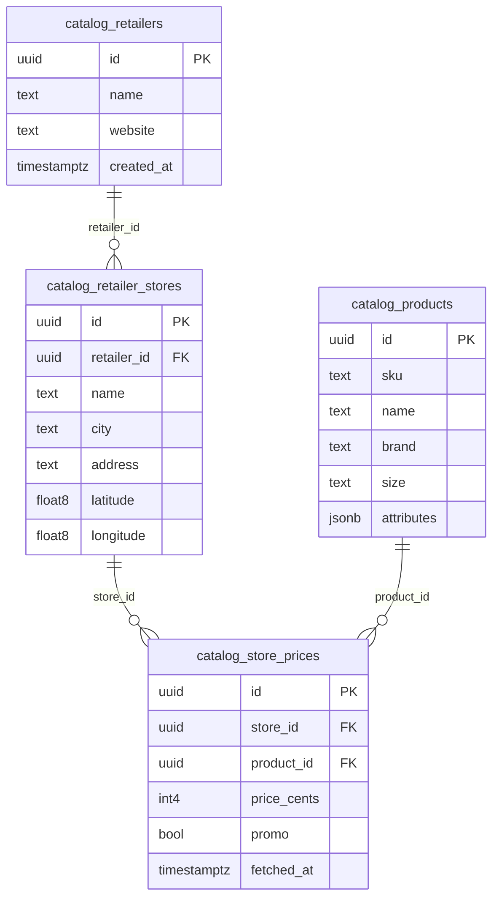
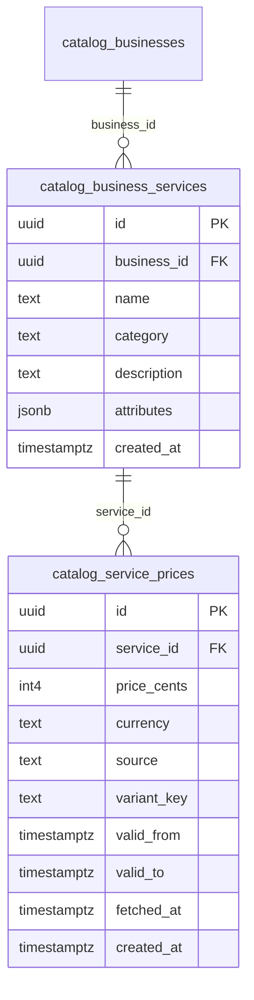

# 数据库框架（当前设计 ER 图）

> Guiding Principle（Lifex Manifesto）
> 我们的核心价值是利用 AI 的能力深入理解每个 business 和每个用户，并据此做最合适的匹配。所有可以合法获取的数据都用于帮助 AI 持续加深理解；随着时间与数据增长，这份理解会不断进化。唯有基于这种理解，我们才能提供让客户满意的一切服务（chat、推荐、AI 助手）以及后续的优惠券、订座、订餐、服务预定、票务购买等下游交易。

## 一、核心域 ER（core / catalog / content / social）

```mermaid
erDiagram
  core_user_profiles {
    uuid id PK
    text full_name
    text avatar_url
    timestamptz created_at
    timestamptz updated_at
  }

  catalog_businesses {
    uuid id PK
    text name
    text description
    text website
    text google_place_id UQ
    numeric lifex_rating
    int4 lifex_review_count
    int4 view_count
    int4 favorite_count
    uuid owner_id FK
    bool is_verified
    bool is_active
    timestamptz created_at
    timestamptz updated_at
  }

  catalog_business_locations {
    uuid id PK
    uuid business_id FK
    text address
    text city
    text country
    float8 latitude
    float8 longitude
    bool is_primary
    timestamptz created_at
  }

  catalog_business_hours {
    uuid id PK
    uuid business_id FK
    int2 day_of_week
    time open_time
    time close_time
  }

  catalog_categories {
    uuid id PK
    text name UQ
    text slug UQ
    timestamptz created_at
  }

  catalog_business_category_links {
    uuid business_id FK
    uuid category_id FK
  }

  catalog_business_aliases {
    uuid id PK
    uuid business_id FK
    text source
    text external_id UQ(source,external_id)
    timestamptz created_at
  }

  catalog_business_merge_map {
    uuid kept_id FK
    uuid removed_id FK
    timestamptz merged_at
  }

  catalog_google_place_cache {
    uuid business_id PK FK
    text place_id
    text name
    text formatted_address
    text international_phone_number
    text website
    int2 price_level
    numeric rating
    int4 user_ratings_total
    jsonb opening_hours
    jsonb geometry
    timestamptz fetched_at
    timestamptz valid_until
  }

  catalog_place_photos_meta {
    uuid id PK
    uuid business_id FK
    text photo_reference
    int4 width
    int4 height
    jsonb attributions
    timestamptz created_at
  }

  catalog_business_curated {
    uuid business_id PK FK
    text name
    text description
    text website
    jsonb hours
    jsonb attributes
    uuid updated_by
    timestamptz updated_at
  }

  catalog_business_owner_updates {
    uuid id PK
    uuid business_id FK
    uuid owner_id FK
    jsonb proposed
    text status
    timestamptz created_at
    uuid reviewed_by
    timestamptz reviewed_at
  }

  catalog_tags {
    uuid id PK
    text name UQ
    text kind
    timestamptz created_at
  }

  catalog_tag_aliases {
    uuid tag_id FK
    text alias
  }

  catalog_business_tag_links {
    uuid id PK
    uuid business_id FK
    uuid tag_id FK
    text source
    numeric confidence
    timestamptz created_at
  }

  catalog_business_attributes {
    uuid id PK
    uuid business_id FK
    text name
    text value
    jsonb value_json
    text source
    numeric confidence
    timestamptz extracted_at
    timestamptz created_at
  }

  catalog_events {
    uuid id PK
    text title
    text description
    timestamptz starts_at
    timestamptz ends_at
    uuid venue_business_id FK
    text city
    text url
    bool is_active
    timestamptz created_at
  }

  catalog_event_curated {
    uuid event_id PK FK
    text title
    text description
    timestamptz starts_at
    timestamptz ends_at
    text timezone
    text location
    text city
    text url
    jsonb attributes
    uuid updated_by
    timestamptz updated_at
  }

  catalog_specials {
    uuid id PK
    uuid business_id FK
    text title
    text description
    timestamptz starts_at
    timestamptz ends_at
    text[] tags
    timestamptz created_at
  }

  catalog_event_scrape_cache {
    uuid id PK
    text source
    text external_id
    text title
    text description
    timestamptz starts_at
    timestamptz ends_at
    text timezone
    text venue_name
    text city
    text url
    jsonb raw
    timestamptz fetched_at
    timestamptz valid_until
    uuid matched_event_id FK
  }

  catalog_special_scrape_cache {
    uuid id PK
    text source
    text external_id
    uuid business_id FK
    text external_business_name
    text title
    text description
    text discount_type
    text discount_value
    numeric original_price
    numeric discounted_price
    text currency
    timestamptz starts_at
    timestamptz ends_at
    text[] tags
    text url
    jsonb raw
    timestamptz fetched_at
    timestamptz valid_until
    uuid matched_special_id FK
  }

  content_reviews {
    uuid id PK
    uuid business_id FK
    uuid user_id FK
    int2 rating
    text content
    timestamptz created_at
    timestamptz updated_at
  }

  social_favorites {
    uuid id PK
    uuid user_id FK
    uuid business_id FK
    timestamptz created_at
  }

  %% 关系（仅列主要外键）
  core_user_profiles ||--o{ content_reviews : "user_id"
  core_user_profiles ||--o{ social_favorites : "user_id"
  catalog_businesses ||--o{ catalog_business_locations : "business_id"
  catalog_businesses ||--o{ catalog_business_hours : "business_id"
  catalog_businesses ||--o{ content_reviews : "business_id"
  catalog_businesses ||--o{ social_favorites : "business_id"
  catalog_categories ||--o{ catalog_business_category_links : "category_id"
  catalog_businesses ||--o{ catalog_business_category_links : "business_id"
  catalog_businesses ||--o{ catalog_business_aliases : "business_id"
  catalog_businesses ||--o{ catalog_place_photos_meta : "business_id"
  catalog_businesses ||--o{ catalog_business_curated : "business_id"
  catalog_businesses ||--o{ catalog_google_place_cache : "business_id"
  catalog_businesses ||--o{ catalog_business_tag_links : "business_id"
  catalog_tags ||--o{ catalog_tag_aliases : "tag_id"
  catalog_tags ||--o{ catalog_business_tag_links : "tag_id"
  catalog_businesses ||--o{ catalog_business_attributes : "business_id"
  catalog_businesses ||--o{ catalog_events : "venue_business_id"
  catalog_events ||--o{ catalog_event_curated : "event_id"
  catalog_businesses ||--o{ catalog_specials : "business_id"
  catalog_events ||--o{ catalog_event_scrape_cache : "matched_event_id"
  catalog_specials ||--o{ catalog_special_scrape_cache : "matched_special_id"
  core_user_profiles ||--o{ catalog_business_owner_updates : "owner_id"
  catalog_businesses ||--o{ catalog_business_owner_updates : "business_id"
  catalog_businesses ||--o{ catalog_business_merge_map : "kept_id"
  catalog_businesses ||--o{ catalog_business_merge_map : "removed_id"
```

## 二、AI 与检索（ai）

```mermaid
erDiagram
  ai_business_embeddings {
    uuid business_id PK FK
    vector embedding
    timestamptz created_at
    timestamptz updated_at
  }

  ai_review_embeddings {
    uuid review_id PK FK
    uuid business_id FK
    vector embedding
    timestamptz created_at
    timestamptz updated_at
  }

  catalog_businesses ||--|| ai_business_embeddings : "business_id"
  content_reviews ||--|| ai_review_embeddings : "review_id"
  catalog_businesses ||--o{ ai_review_embeddings : "business_id"
```

## 三、运维与计费（ops / billing，摘要）

- ops.jobs（任务注册）、ops.job_runs（运行记录）
- billing.customers / products / prices / subscriptions / payments（详见 `database/BILLING_DDL_DRAFT.sql`）

## 四、零售商品与价格（超市）



## 五、通用服务（菜单/服务）与价格



## 六、说明
- 视图：前端仅访问 `public` 视图，如 `public.business_list`、`public.business_page`、`public.events_page`、`public.deals_page`、`public.business_profile`（合并优先级：owner_approved → curated → base → google_cache）。
- 写入：前端仅通过 RPC（如 `add_favorite`、`add_review`、`submit_business_update`）；采集/提升级通过仅 `service_role` 可执行的 RPC（如 `upsert_business_from_ingest`、`promote_scraped_event/special`）。
- 安全：领域底表全部启用 RLS；`public` 视图去除 PII；最小授权。
- 扩展：如需更细的 ER，可按域拆分为多张图（catalog-only、content-only 等）。
